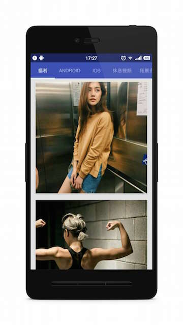
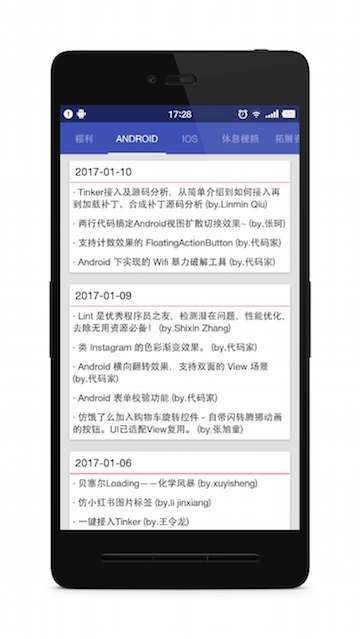
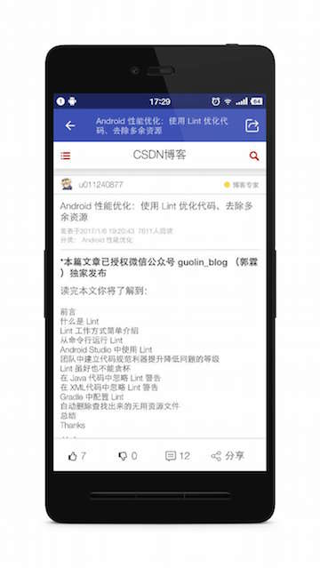

# gank
http://gank.io/ 非官方Android客户端

### 所用技术：

- Material Design
- DataBinding
- RxJava
- Retrofit
- 微信，QQ第三方分享
- Glide
- PhotoView

### 应用截图：

### 

### 感谢各位大神提供的参考
- [drakeet/Meizhi](https://github.com/drakeet/Meizhi)
- [LyndonChin/MasteringAndroidDataBinding](https://github.com/LyndonChin/MasteringAndroidDataBinding)
- [所有API来自干货集中营](http://gank.io/api)

###License

	Copyright 2016 yolo.cc

    Licensed under the Apache License, Version 2.0 (the "License");
    you may not use this file except in compliance with the License.
    You may obtain a copy of the License at
    
       http://www.apache.org/licenses/LICENSE-2.0
    
    Unless required by applicable law or agreed to in writing, software
    distributed under the License is distributed on an "AS IS" BASIS,
    WITHOUT WARRANTIES OR CONDITIONS OF ANY KIND, either express or implied.
    See the License for the specific language governing permissions and
    limitations under the License.
